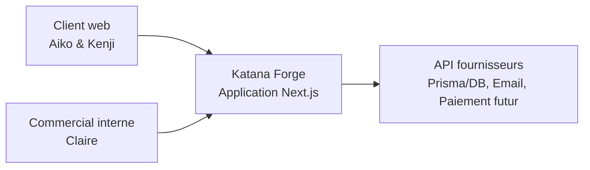
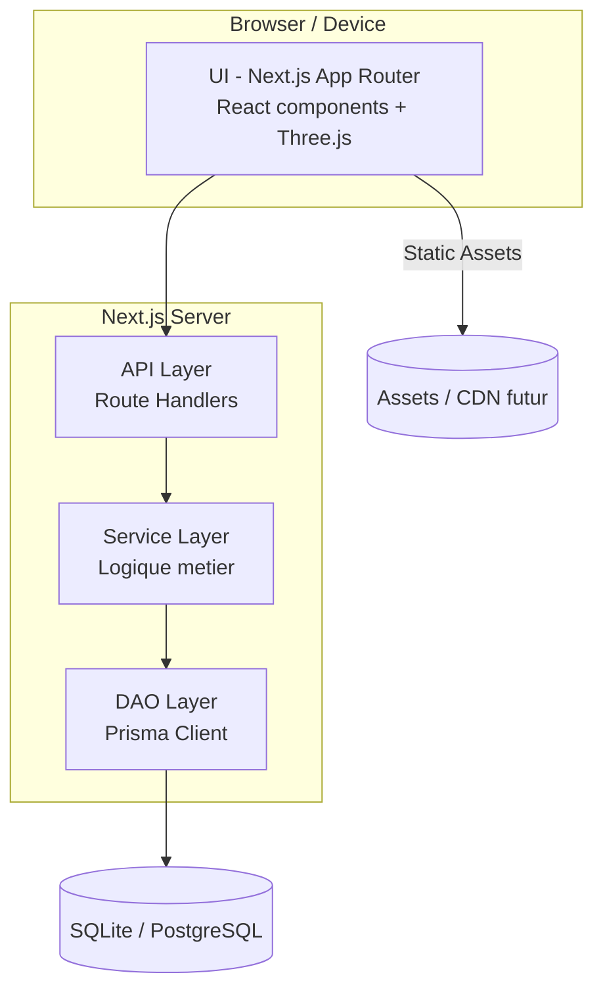
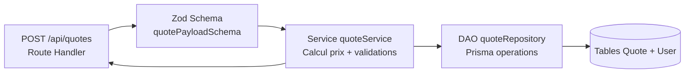

# Architecture multi-couche - Katana Forge

## Presentation generale
- **UI (Next.js App Router)** : pages, layouts et composants React (3D via `react-three-fiber`), interactions utilisateur et gestion du routing.
- **API (Next.js Route Handlers)** : endpoints REST `/api/auth/*`, `/api/katanas`, `/api/quotes`, validations et orchestration des services.
- **Service** : fonctions dans `lib/` et `services/` (si introduits) encapsulant la logique metier (calcul de devis, gestion d'authentification, notifications).
- **DAO** : couches Prisma (clients, repositories) responsables des acces BD, mapping domain <-> schema.
- **DB** : base Prisma/SQLite (ou connecteur equivalent) definie via `schema.prisma`.

Les flux suivent le schema : `UI -> API -> Service -> DAO -> DB`, avec retours d'erreurs normalises (`Result`/`throw` capture) et validation en entree/sortie.

## C4 niveau Contexte

## C4 niveau Containers

## C4 niveau Composants (exemple Route `/api/quotes`)

## Flux request / response
1. **UI** appelle l'API via `fetch` ou actions server -> payload valide.
2. **API** applique la validation (Zod), gere session (`next-auth`/middleware) puis delegue au service.
3. **Service** orchestre la logique (calculs, feature flags, audit) et controle les permissions.
4. **DAO** effectue les requetes Prisma, mappe les erreurs (conflits, not found).
5. **DB** retourne les donnees ; reponses formattees coté API (JSON).

## Guidelines par couche
- **UI** : composants purs, hooks `useQuery` ou fetch serverside, ne jamais contenir d'access direct BD.
- **API** : aucune logique metier complexe, se limite aux validations, mapping HTTP, status codes.
- **Service** : fonctions testables, idempotentes lorsque possible, isolent les dependances externes.
- **DAO** : uniquement des operations dataset (CRUD, requetes), pas de logique metier.
- **DB** : schema versionne via migrations Prisma, surveillance des indexes pour requetes critiques.

## Observabilite et erreurs
- Logger (p.ex. `pino`, `console`) au niveau Service, capture des erreurs critiques via Sentry (a integrer).
- Tracer les appels 3D lourds et les operations de calcul devis pour ajuster budget performance.
- Normer les messages d'erreur utilisateur (UI) vs logs (Service/DAO).
