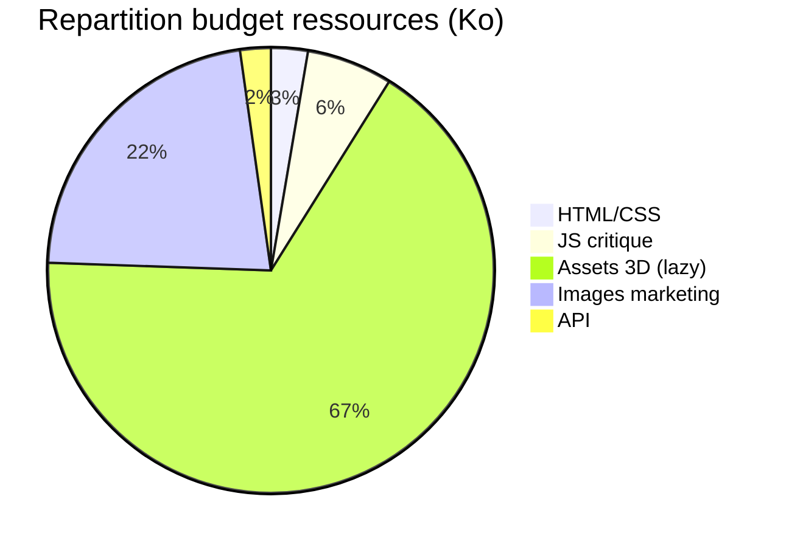
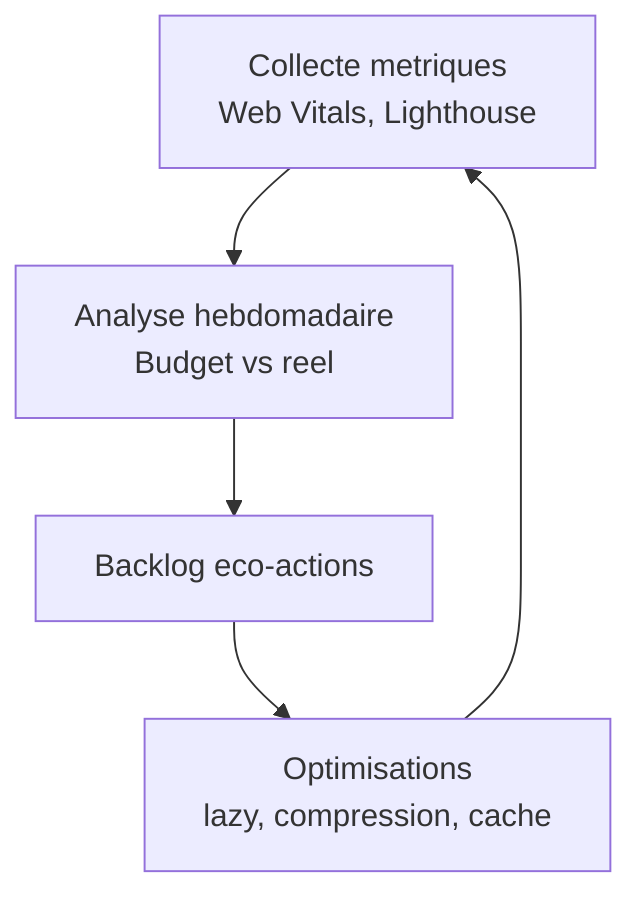

# Eco-conception - Katana Forge

## Objectifs
- Limiter l'empreinte carbone digitale tout en conservant une experience 3D riche.
- Respecter un budget de performance cible : **LCP < 2.5s**, **bundle initial < 200 Ko gzip**, **interactions 3D < 16ms/frame** sur laptop milieu de gamme.
- Favoriser la sobriete : chargement progressif, recyclage des assets, monitoring continu.

## Budget performance (indicatif)
| Element | Budget cible | Notes |
| --- | --- | --- |
| HTML + CSS init | < 60 Ko | Tailwind purge + compression Brotli |
| JS critique | < 140 Ko gzip | App Router + composants essentiels (sans 3D) |
| 3D bundle | lazy load, < 1.5 Mo | GLB optimises, textures compresses (`basis`) |
| Images marketing | < 500 Ko total | Utiliser `next/image`, formats WebP/AVIF |
| API response | < 50 Ko | Pagination, champs limites |

## Images & assets
- Utiliser `next/image` avec `fill`/`responsive`, formats `AVIF` > `WebP` > `JPEG`.
- Compresser les textures 3D (KTX2/Basis), reduire la resolution des maps non critiques.
- Mutualiser les sprites icones via `@phosphor-icons/react` ou `Iconify` tree shaking.
- Mettre en cache CDN (Header `Cache-Control`) pour assets statiques 1 an.

## Bundling & code splitting
- Exploiter les segments App Router : charger uniquement les layout nécessaires.
- Utiliser `next/dynamic` pour les composants lourds (canvas 3D, configuration).
- Eviter les polyfills globaux, privilegier l'import dynamique (`import('three/examples/...')`).
- Activer `swcMinify`, `modularizeImports` (Tailwind, date-fns).
- Surveiller le `bundle analyzer` (`next build && ANALYZE=true next build`).

## Lazy / dynamic import
- `dynamic(() => import('components/configurator/KatanaCanvas'), { ssr: false, loading: <Skeleton /> })`.
- Charger les outils d'analyse (Sentry, Crisp) uniquement en production et apres interaction.
- Prefetch des routes critiques (`app/compte`, `app/atelier`) uniquement lorsque l'utilisateur est authentifie.

## Sobriete fonctionnelle
- Limiter les animations superflues, preferer transitions CSS courtes (< 150ms).
- Offrir un mode "lite" (desactivation textures haute definition) pour machines faibles.
- Minimiser les requetes API : batching, revalidation via `SWR`/`React Query`.
- Notifications emails uniquement si necessaires (regroupement).

## Suivi & mesures

- Ajouter Web Vitals (`next/script`) pour remonter LCP/CLS/TTI (en dev).
- Mettre en place un rapport Lighthouse CI sur PR critiques.
- Suivre l'utilisation temps reel (Dynatrace, Sentry Performance) pour detection derive.

## Checklist eco
- [ ] Bundle initial < budget (verifier `next build`).
- [ ] Assets images convertis en WebP/AVIF, < 500 Ko total.
- [ ] Composant 3D charge en lazy + fallback accessible.
- [ ] Compression Gzip/Brotli active coté vercel/nginx.
- [ ] Monitoring Web Vitals + score Lighthouse > 85 (mobile).
