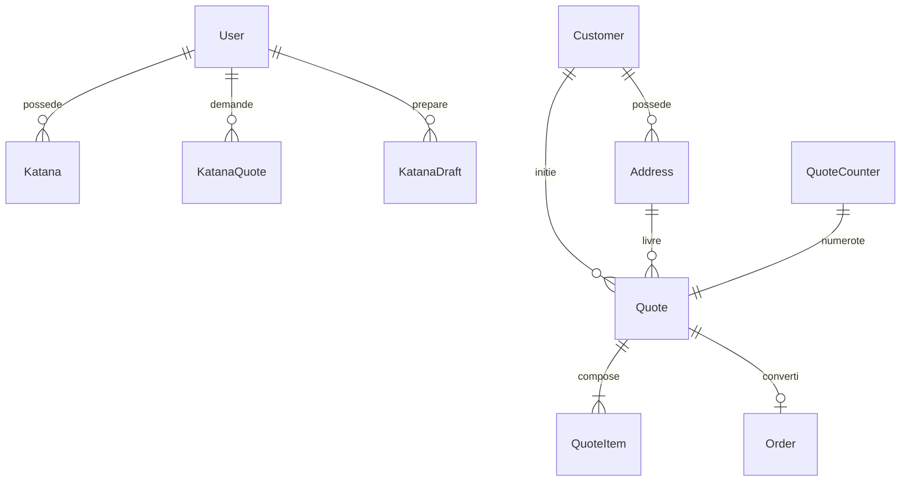
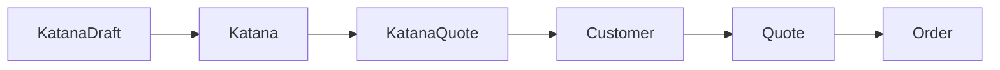

# Modele de donnees - Katana Forge

Cette reference presente la structure relationnelle geree par Prisma (PostgreSQL). Elle couvre le modele conceptuel (MCD), le modele physique (MPD) ainsi que les cles, contraintes et index principaux.

## MCD (vue conceptuelle)


## MPD (vue tables physiques)
- `User(id, email, passwordHash, name, backgroundColor, googleId, createdAt, updatedAt)`
- `Katana(id, ownerId->User.id, name, handleColor, bladeTint, metalness, roughness, createdAt, updatedAt)`
- `KatanaQuote(id, userId->User.id?, price, currency, estimatedDeliveryWeeks, config, createdAt)`
- `KatanaDraft(id, ownerId->User.id?, guestToken, handleColor, bladeTint, metalness, roughness, quantity, createdAt, updatedAt)`
- `Customer(id, email, firstName, lastName, phone, createdAt)`
- `Address(id, customerId->Customer.id, type, company, vatNumber, line1, line2, city, postalCode, country, createdAt)`
- `Quote(id, number, customerId->Customer.id, shippingAddrId->Address.id, billingAddrId->Address.id, currency, subtotalCents, taxCents, shippingCents, totalCents, status, payLink, pdfPath, sentAt, consentAt, policyVersion, createdAt)`
- `QuoteItem(id, quoteId->Quote.id, sku, name, qty, unitCents, vatRatePct, totalCents)`
- `QuoteCounter(year, counter, createdAt, updatedAt)`
- `Order(id, customerId->Customer.id, quoteId->Quote.id?, stripePaymentId, currency, totalCents, status, createdAt)`

## Cles et contraintes
- Cles primaires : identifiants `TEXT` (cuid) pour toutes les tables sauf `QuoteCounter` (`year`).
- Contraintes d'unicite : `User.email`, `User.googleId`, `KatanaDraft.guestToken`, `Customer.email`, `Quote.number`, `Order.quoteId`.
- Contraintes de reference :
  - `Katana.ownerId` (`ON DELETE CASCADE`)
  - `KatanaQuote.userId` (`SET NULL`)
  - `KatanaDraft.ownerId` (`CASCADE`)
  - `Address.customerId`, `Quote.customerId` (`CASCADE`)
  - `Quote.shippingAddrId`, `Quote.billingAddrId` (`RESTRICT`)
  - `QuoteItem.quoteId` (`CASCADE`)
  - `Order.customerId` (`CASCADE`), `Order.quoteId` (`SET NULL`)

## Index et performances
- Index de base sur chaque cle primaire (BTREE).
- Index explicites : `User_email_key`, `User_googleId_key`, `KatanaDraft_guestToken_key`, `Customer_email_key`, `Quote_number_key`, `Order_quoteId_key`.
- Recommandations :
  - Index compose `Katana(ownerId, createdAt desc)` pour la liste UI (ajoutable via `@@index`).
  - Index `Quote(status, createdAt)` pour les filtres back-office.
  - Table `QuoteCounter` deja couverte par sa cle primaire annuelle.

## Schema Prisma (extrait)
```prisma
model Katana {
  id          String   @id @default(cuid())
  owner       User     @relation(fields: [ownerId], references: [id], onDelete: Cascade)
  ownerId     String
  name        String
  handleColor String
  bladeTint   String
  metalness   Float
  roughness   Float
  createdAt   DateTime @default(now())
  updatedAt   DateTime @updatedAt
}
```

## Flux creation devis


## Notes de conception
- `User` gere l'authentification interne, `Customer` represente les prospects/clients cibles pour les devis.
- Les drafts permettent la sauvegarde anonyme (guest) avant creation de compte.
- `QuoteCounter` garantit une numerotation sequentielle et atomique via transaction.
- `Order` reference optionnellement un devis (commande hors devis acceptee).

## Pistes d'evolution
- [ ] Ajouter une table `AuditLog` (consentements, acces sensibles).
- [ ] Ajouter l'index `Katana(ownerId, updatedAt)` pour les listes triees.
- [ ] Prevoir une table `Attachment` pour stocker les PDF generes.
