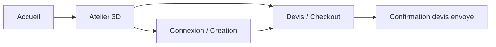
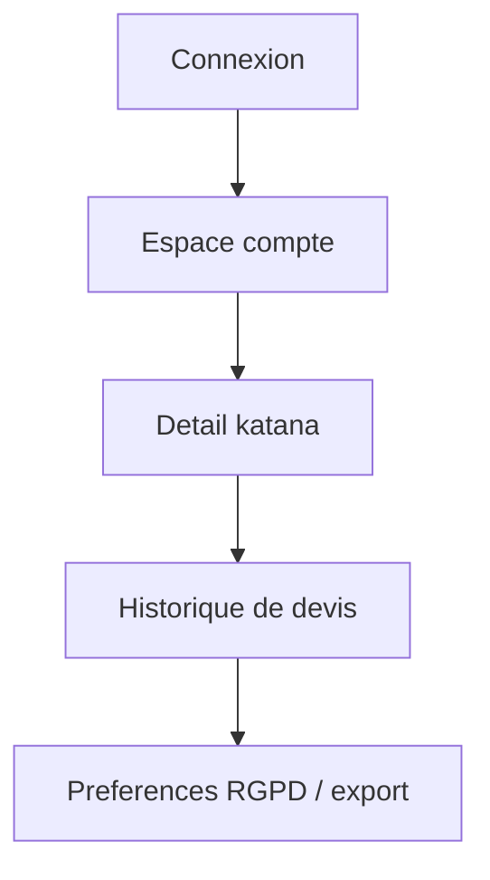
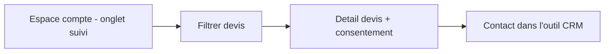

# Flows utilisateurs

Les diagrammes suivants illustrent l'enchainement des ecrans principaux. Utiliser ces flows pour valider les stories avant maquettage detaille.

## Parcours 1 - Visiteur -> Devis
````ascii
Accueil -> Atelier 3D -> Connexion (si necessaire) -> Devis / Checkout -> Confirmation
````



Points clefs :
- Collecter le consentement RGPD sur l'ecran Devis et rappeler les mentions dans le footer.
- Si l'utilisateur est deja connecte, sauter l'ecran Connexion et pre-remplir les donnees.

## Parcours 2 - Utilisateur connecte -> Gestion compte
````ascii
Connexion -> Espace compte -> Detail katana -> Historique devis -> Preferences RGPD
````



Points clefs :
- Afficher la date de dernier consentement RGPD et proposer mise a jour.
- Fournir un bouton d'export simple (CSV/PDF) depuis le bloc preferences.

## Parcours 3 - Commercial interne
````ascii
Dashboard (Compte) -> Filtre devis -> Detail devis -> Contact client (via CRM)
````



Points clefs :
- Toujours afficher le statut du consentement avant de contacter le client.
- Lien direct vers les mentions legales depuis le detail du devis.

