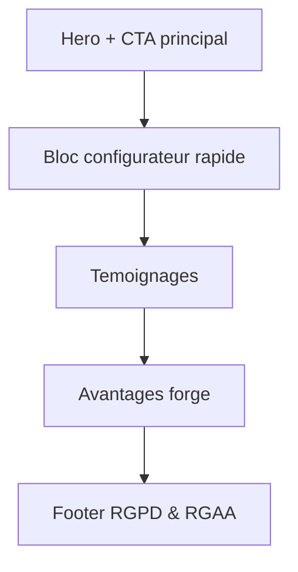
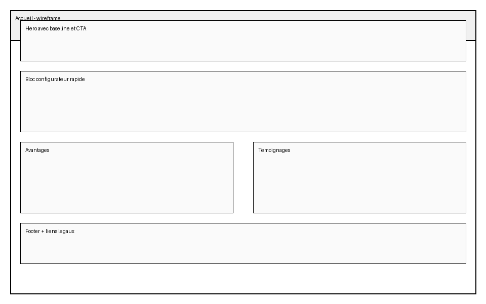
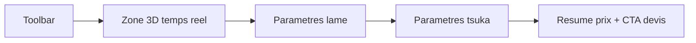
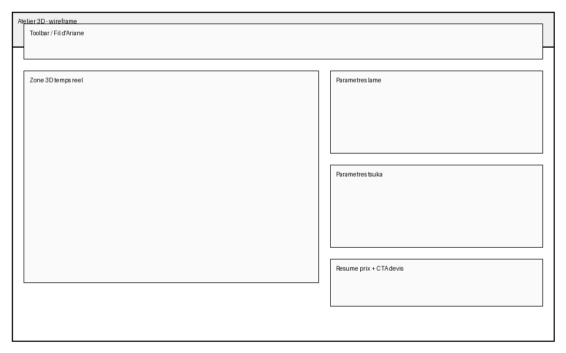
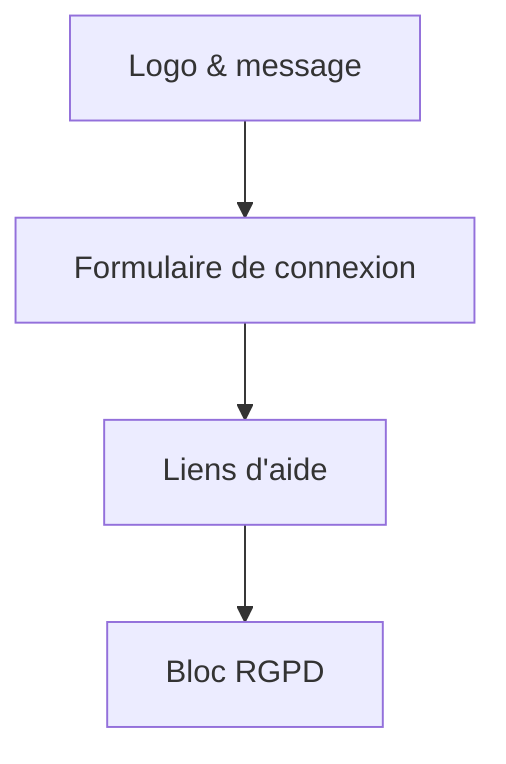
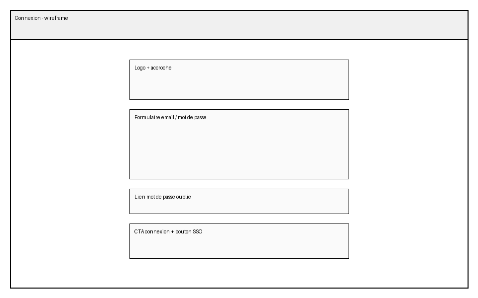
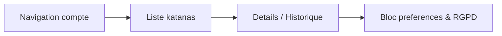
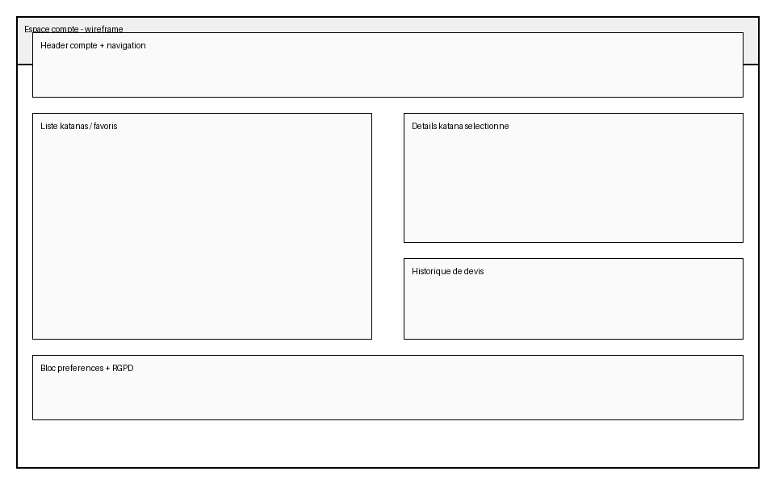
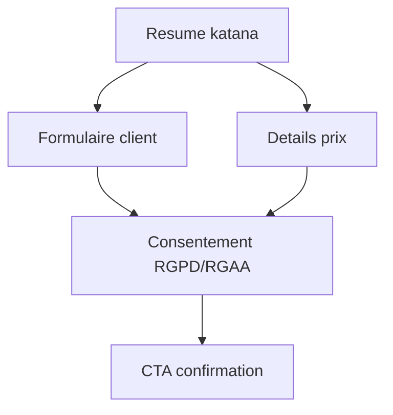
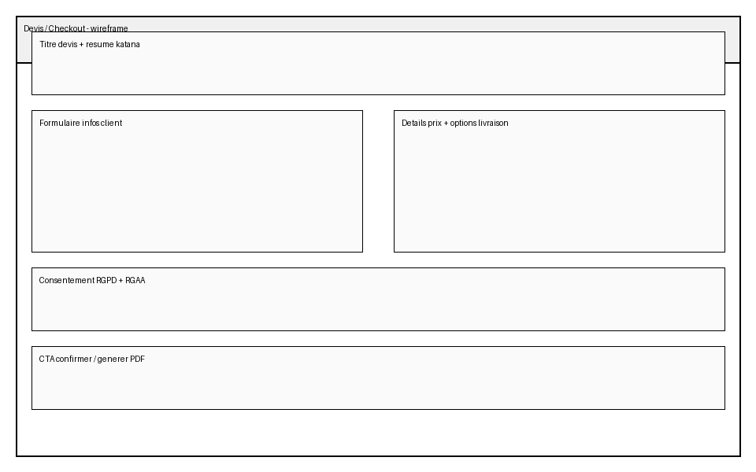

# Maquettes basse fidelite

Chaque ecran dispose d'un wireframe ASCII, d'un schema Mermaid (exportable en PNG) et d'une capture generique en PNG generee automatiquement (`docs/design/img/`).

## Accueil
````ascii
┌──────────────────────────────────────────────────────────────┐
│                       HERO + CTA                             │
├──────────────────────────────────────────────────────────────┤
│  Config rapide                    │  Temoignages clients      │
│  (3 etapes)                       │  (quotes courtes)         │
├──────────────────────────────────────────────────────────────┤
│  Avantages forge (3 colonnes)     │  Mise en avant atelier    │
├──────────────────────────────────────────────────────────────┤
│ Footer : mentions legales, RGPD, acces RGAA                   │
└──────────────────────────────────────────────────────────────┘
````





## Atelier 3D
````ascii
┌──────────────────────────────────────────────────────────────┐
│ Toolbar / Fil d'Ariane                                       │
├───────────────┬──────────────────────────────────────────────┤
│   Zone 3D     │  Parametres lame                             │
│   interactive │  Parametres tsuka                            │
│               │  Resume prix + CTA devis                     │
├───────────────┴──────────────────────────────────────────────┤
│ Footer : infos support & accessibilite                       │
└──────────────────────────────────────────────────────────────┘
````





## Connexion
````ascii
┌─────────────────────────────┐
│ Logo + accroche             │
├─────────────────────────────┤
│ Champ email                 │
│ Champ mot de passe          │
│ Bouton connexion            │
├─────────────────────────────┤
│ Lien mot de passe oublie    │
│ CTA SSO / creation compte   │
├─────────────────────────────┤
│ Mentions RGPD + consentement│
└─────────────────────────────┘
````





## Espace compte
````ascii
┌──────────────────────────────────────────────────────────────┐
│ Header compte + navigation secondaire                        │
├───────────────┬──────────────────────────────────────────────┤
│ Liste katanas │ Détails selection + Historique devis         │
│ + favoris     │                                              │
├───────────────┴──────────────────────────────────────────────┤
│ Bloc preferences : consentements, RGPD, export donnees       │
└──────────────────────────────────────────────────────────────┘
````





## Devis / Checkout
````ascii
┌──────────────────────────────────────────────────────────────┐
│ Resume katana + titre devis                                  │
├───────────────┬──────────────────────────────────────────────┤
│ Formulaire    │ Details prix + options livraison              │
│ infos client  │                                              │
├───────────────┴──────────────────────────────────────────────┤
│ Consentement RGPD + accessibilite RGAA                       │
├──────────────────────────────────────────────────────────────┤
│ CTA confirmer + generation PDF                               │
└──────────────────────────────────────────────────────────────┘
````





